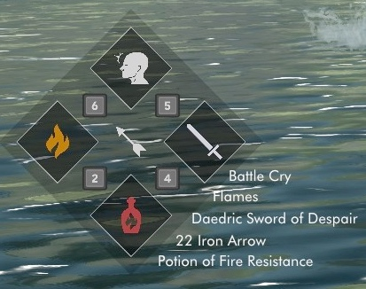

# Soulsy

[](https://github.com/ceejbot/soulsy/actions/workflows/test.yaml) [](https://github.com/ceejbot/soulsy/actions/workflows/build.yaml)

Soulsy is a lightweight, fast Souls-style hotkey HUD mod for Skyrim SE and AE. It is inspired by hotkey mods like Elden Equip, iEquip, and LamasTinyHud. It started life as a fork of [LamasTinyHud](https://github.com/mlthelama/LamasTinyHUD), though it has since diverged significantly.



The [NexusMods page](https://www.nexusmods.com/skyrimspecialedition/mods/96210/) has screenshots and videos of the HUD in use as well as player documentation. The documentation is more readable here in markdown. See [Configuring the HUD](./docs/article-options.md) and [Customizing Layouts](docs/article-layouts.md).

## Development goals

My goals are two-fold: make a Souls-style equip HUD that is exactly what I want to use, and learn how to do Rust FFI. A bonus is demonstrating how to write Skyrim native-code mods in Rust.

This project has been released and is in active use. My eventual goal is to move everything except the SKSE plugin glue code to Rust, and have the C++ mostly vanish. There will always be some C++ in the project to interact with the Skyrim reverse-engineered library, which is all in C++ as is the game itself.

## Skyrim 1.7.104.0 Support

This release branch adds support for **The Elder Scrolls V: Skyrim Special Edition / Anniversary Edition runtime 1.7.104.0** (SKSE 2.3.1), while maintaining compatibility with previously supported runtime versions.

Key compatibility updates:
- Updated to CommonLibSSE-NG (`https://github.com/alandtse/CommonLibVR`, branch `ng`, commit `1504349dddfc622d4d25704bba19e2ade669dc5a`) with verified Skyrim 1.7.104.0 Address Library ID relocations.
- Updated `time` dependency to 0.3.44 for modern Rust toolchain compatibility.
- Resolved C++23 / MSVC compiler changes: DirectX buffer casts, sound handle API modernization, and `__cdecl` SKSEAPI trampoline definitions.
- Enhanced MCM Keymap configuration: Added `ignoreConflicts: true` across all key mapping controls so vanilla keybindings, action keys, and modifier keys can be mapped cleanly.
- Robust settings parsing: `FromIniStr` handles unmapped/cleared keys (`-1` -> unassigned) and hex codes without reverting to default keys.

## Building

Soulsy is a Rust and C++ project, using CMake to drive Cargo to build the Rust parts. The application logic is implemented in Rust, with a bridge to the C++ libraries required to implement an SKSE plugin. It requires the following to build:

- [Rust](https://rustup.rs) set up for Windows (MSVC ABI)
- [Visual Studio 2022](https://visualstudio.microsoft.com) with C++ tools (v143 toolset)
- [CMake](https://cmake.org) (version 3.22 or higher)
- [vcpkg](https://github.com/microsoft/vcpkg) with `VCPKG_ROOT` set in your environment

The plugin requires the following vcpkg libraries, which will be installed automatically:

- [spdlog](https://github.com/gabime/spdlog)
- [imgui](https://github.com/ocornut/imgui)

Finally, [CommonLibSSE-NG](https://github.com/alandtse/CommonLibVR) is pulled in as a git submodule in `extern/CommonLibSSE-NG`.

### Build Steps

```powershell
# Clone with submodules
git clone --recursive https://github.com/ceejbot/soulsy.git
cd soulsy

# Configure with CMake preset
cmake --preset vs2022-windows

# Build Release DLL
cmake --build --preset vs2022-windows --config Release
```

The compiled plugin `SoulsyHUD.dll` and matching `SoulsyHUD.pdb` will be generated in `build/Release/`.

You are absolutely invited to contribute. This project follows the standard [Contributor's Covenant](./CODE_OF_CONDUCT.md).

## Credits

I could not have approached the rendering code without the work in [LamasTinyHud](https://www.nexusmods.com/skyrimspecialedition/mods/82545), so [mlthelama](https://github.com/mlthelama) gets all the props. I also learned a lot about how to make an SKSE plugin by reading their source. Give that HUD a try if you don't like the souls-game style, or want a UI you can edit in-game. The original is the only hotkeys hud mod I tried that worked well in my game, so that's a testimonial.

The icons for the built-in theme are the usual SkyUI icons, plus the `futura-book-bt` true-type font. The background assets were built from scratch but were inspired by the [Untarnished UI skin](https://www.nexusmods.com/skyrimspecialedition/mods/82545) for LamasTinyHUD by [MinhazMurks](https://www.nexusmods.com/skyrimspecialedition/users/26341279).

The built-in icons are the SkyUI icons by psychosteve, which are used in so many places I am not sure how to credit them. The icons for the Ceej remix layout are licensed to me from the Noun Project for use without attribution, but I am going to give attribution anyway because they're great icons. I am using the [Role Playing Game collection](https://thenounproject.com/browse/collection-icon/role-playing-game-70773/?p=1) by [Maxicons](https://thenounproject.com/maxicons/). The THICC icon pack uses icons with permission from the [THICC icon mod](https://www.nexusmods.com/skyrimspecialedition/mods/90508).

The font in use for some layouts is [Inter](https://rsms.me/inter/).

[cxx](https://cxx.rs/) made developing the C++/Rust bridge a snap. This crate unlocks Rust as a viable language for all of your modding needs. [bindgen](https://rust-lang.github.io/rust-bindgen/introduction.html) is also available for doing this, but `cxx` generates _safer_ C++ bindings by restricting the kinds of code generated. Its major drawback is that async Rust is not yet supported, but there are workarounds described in the docs.

## License

GPL-3.0.
